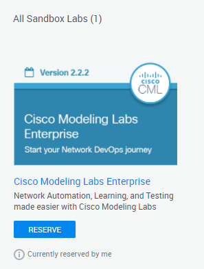
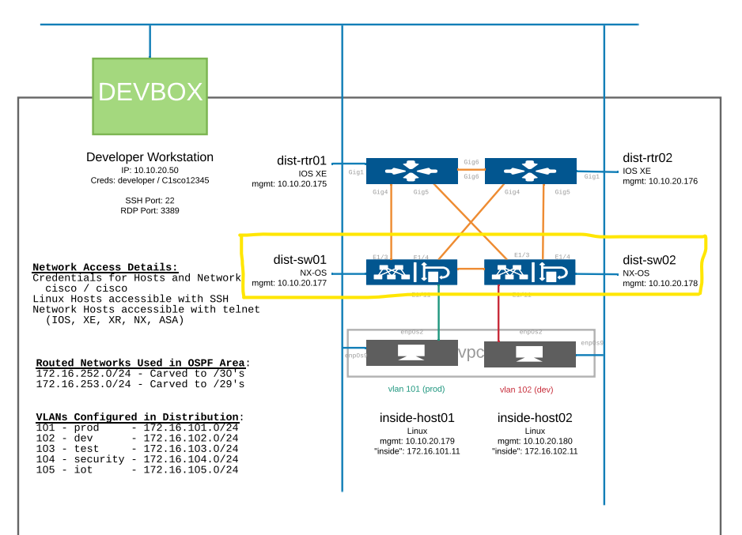

# Mind nMap


[](https://developer.cisco.com/codeexchange/github/repo/automateyournetwork/mind_nmap)

This script uses a number of different genie parses to create a formated markdown file and rendered HTML file of a given core-distribution-access Cisco topology.
# Getting Started
1.	We recommend creating a python virtual environment to run this utility
2.	Software dependencies: pyATS and Markmap

# Installation for Ubuntu
Virtual Environment

We recommend running Mind nMap in a Python virtual environment while testing or developing. This will help keep your host system clean and allow you to have multiple environments to try new things. If you are not using a virtual environment, start at the download/clone step below.

You will also need Python 3, pip, and venv installed on your host system.

In your project directory, create your virtual environment
``` console
python3 -m venv env
```
Activate (use) your new virtual environment (Linux):
``` console
source env/bin/activate
```
Download or clone the mind_nmap repository:

``` console
git clone https://github.com/automateyournetwork/mind_nmap.git
```

Install pyATS and markmap into your environment:
``` console
pip install pyats[full]
sudo apt update
sudo apt install npm
sudo npm install markmap-cli -g
```

# Create your testbed file
here is an example of the required testbed file:
*** SINGLE DEVICE ***
``` yaml
devices:
    Dist:
      alias: 'Dist'
      type: 'router'
      os: 'iosxe'
      role: dist
      platform: cat4500
      credentials:
        default:
          username: admin
          password: {{password}}
      connections:        
        cli:
          protocol: ssh
          ip: "192.168.1.10"
          arguments:
            connection_timeout: 360
```

*** TOPOLOGY ***
``` yaml
devices:
    Core:
      alias: 'Core'
      type: 'router'
      os: 'iosxe'
      role: dist
      platform: c9600
      credentials:
        default:
          username: admin
          password: {{password}}
      connections:        
        cli:
          protocol: ssh
          ip: "192.168.1.1"
          arguments:
            connection_timeout: 360
    Dist:
      alias: 'Dist'
      type: 'router'
      os: 'iosxe'
      role: dist
      platform: cat4500
      credentials:
        default:
          username: admin
          password: {{password}}
      connections:        
        cli:
          protocol: ssh
          ip: "192.168.1.5"
          arguments:
            connection_timeout: 360
    Access:
      alias: 'Access'
      type: 'router'
      os: 'iosxe'
      role: access
      platform: cat9300
      credentials:
        default:
          username: admin
          password: {{password}}
      connections:        
        cli:
          protocol: ssh
          ip: "192.168.1.10"
          arguments:
            connection_timeout: 360
```

NOTE: Highly recommended to encryt your passwords. Please use the following link for instructions on how to encyrpt your passwords with pyATS.
https://pubhub.devnetcloud.com/media/pyats/docs/utilities/secret_strings.html

## important note:
we use the custom tag <B>role</b> in our testbed to help build the topology, please lable your devices as <B> core, dist, or access</B>

# Create your Markmap
``` console
$ cd mind_nmap
$ cd MindMaps
$ pyats run job MindMap_job.py --testbed-file ../testbeds/testbed_MindMap.yml
```

# Viewing your MarkMap
The script will create one Layer 2 network map under /MindMaps/Devices/MindMap.md.

To view the formatted output as a markmap please install the MarkMap extension for VS Code or the files can be view externally by viewng the html versions.


Additionally there will be a markdown file per device that is also created. They will be located in the MindMaps/Network/Devices. 


NOTE: the script has only been run on Cisco Catalyst and Nexus devices.


# Links to dependancies
## pyATS: 
https://developer.cisco.com/pyats/
## MarkMap:
https://markmap.js.org/repl

# Try It Yourself! 

Using the Cisco DevNet CML Sandbox you can try it for yourself! 

1) Visit https://devnetsandbox.cisco.com/RM/Topology

2) Reserve the CML Sandbox



3) Update the <b>testbed_MindMap.yml</b> topology from the <b>testbed_CML_Sandbox_MindMap.yml</b> (Replace the contents) to match the Access Layer 

testbed_MindMap.yml

```yaml
devices:
    dist-sw01:
     alias: 'dist-sw01'
     type: 'switch'
     os: 'nxos'
     role: 'access'
     platform: n9k
     credentials:
       default:
         username: cisco
         password: cisco
     connections:        
       cli:
         protocol: "ssh"
         ip: "10.10.20.177"
         arguments:
           connection_timeout: 360
    dist-sw02:
     alias: 'dist-sw02'
     type: 'switch'
     os: 'nxos'
     role: 'access'
     platform: n9k
     credentials:
       default:
         username: cisco
         password: cisco
     connections:        
       cli:
         protocol: "ssh"
         ip: "10.10.20.178"
         arguments:
           connection_timeout: 360
```


